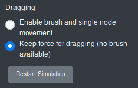
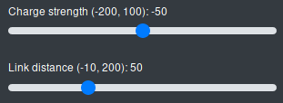
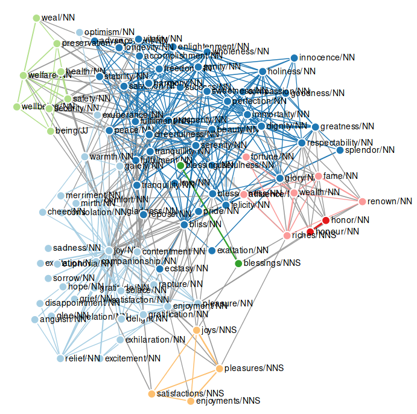
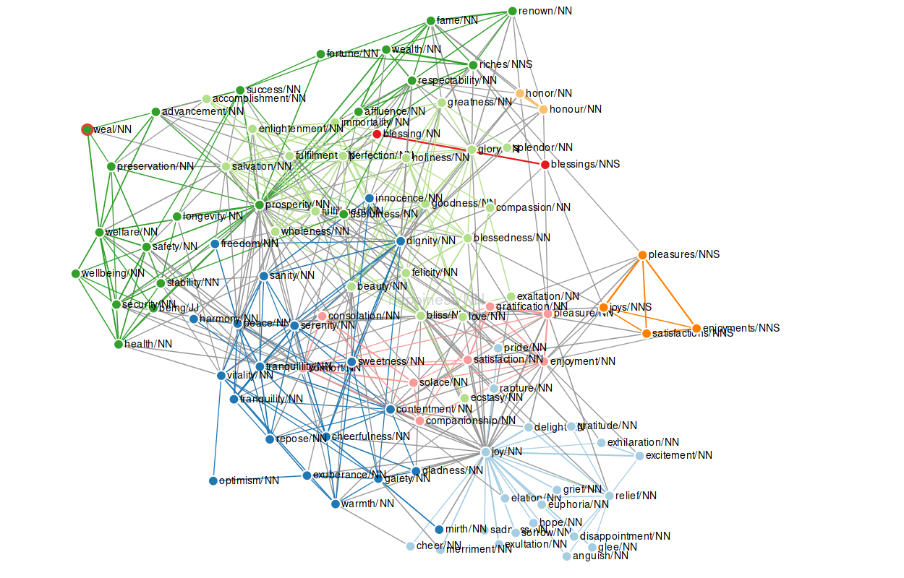
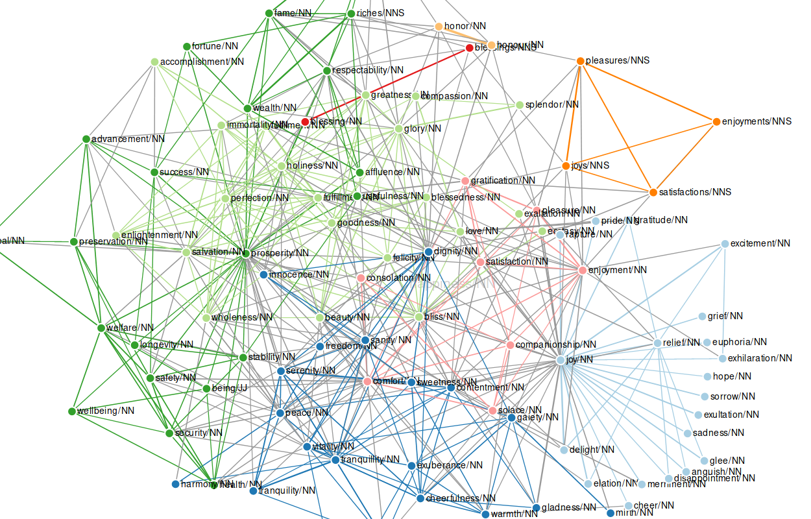
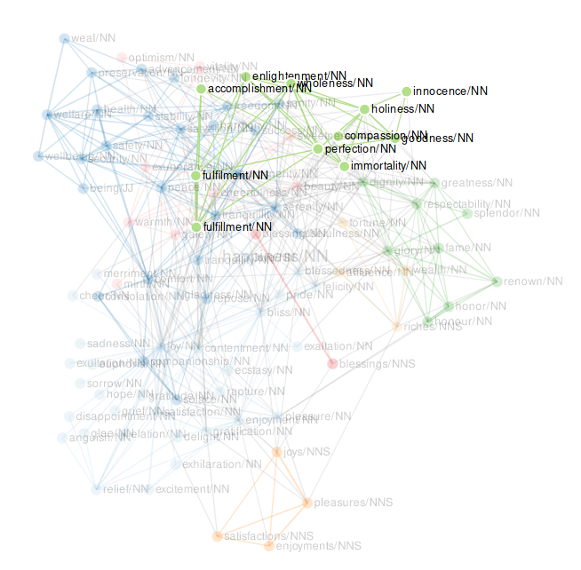
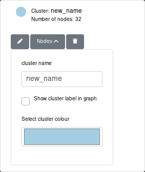
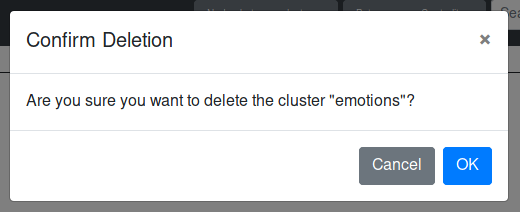

# Editing the Graph via the Functions of the Editing Sidebar

The graph and the clusters produced by the program can be edited and, if necessary, corrected. The user can decide between two different dragging behaviours, as well as influence parameters of the force simulation, which is used to calculate the position of the nodes in the graph. In this section I will describe all the functionalities avaibable in the toggable editing sidebar. For more information on how to manipulate the graph directly, see [the section on interacting with the graph](interacting.md).

## Contents

* [Choosing the Dragging Behaviour](#choosing-the-dragging-behaviour)
* [Manipulate the Simulation](#manipulate-the-simulation)
* [Editing the Clusters](#editing-the-clusters)
* [Edit Cluster Name](#edit-cluster-name)
* [Edit Cluster Colour](#edit-cluster-colour)
* [Add Cluster Node](#add-cluster-node)
* [Delete Cluster Node](#delete-cluster-node)
* [Delete Complete Cluster](#delete-complete-cluster)

## Choosing the Dragging Behaviour

The user can select between two different kinds of dragging behaviour.

1. **Enable brush (no force).** This enables to user to select multiple nodes at the same time using a brush movement and dragging all of them at the same time to a different position. The force is not acitve, so that the other nodes to not reposition themselves.
2. **Use force (no brush available).** This is the default dragging behaviour. Only one node can be dragged at a time and the other nodes reposition themselves according to the force simulation. The dragged node is then fixed to its new position, which means that its position does not change if the force parameters are updated or other nodes dragged somewhere.

All the nodes that are fixed to their position can be released by clicking on the button "Restart Simulation".

For how to drag nodes in the graph, see [the section on interacting with the graph](interacting.md).

[To the top](#editing-the-graph-via-the-functions-of-the-editing-sidebar)

## Manipulate the Simulation

SCoT lets you edit two simulation parameters: the charge strength between the nodes and the link distance.
The default value for the charge strength is -50, the default value for the link distance is 50.
A graph with 100 nodes, 30 edges and these simulation parameter values looks like this:

{:height="75%" width="75%"}

The use can change the value of the charge strength from values in the range of -200 to 100. Changing the charge strength influences the repelling forces between the nodes. The same graph with a charge strength of -100 and the default link distance looks as follows:

As a rule of thumb, a negative charge strength pushes the nodes further apart, simulating repulsion, and a positive charge strength pushes nodes together, simulating gravity or attraction.

The link distance influences the distance between nodes and therefore the length of the edges between them. A high link distance means a long distance between nodes, a low link distance means a small distance between nodes. The following example shows and graph with a link distance of 150 and the default charge.

 

[To the top](#editing-the-graph-via-the-functions-of-the-editing-sidebar)

## Editing the Clusters

In the edit column all the clusters in the graph are listed. For each cluster there are three buttons: one to edit the cluster and another to display a list of all the nodes contained in the respective cluster, and one to delete the cluster.

When hovering over the coloured circle next to the cluster name, all the nodes and edges in the graph belonging to the cluster are faded in in the graph.

In some cases, nodes are not connected to any other in the graph. They are only neighbours of the target word. Then, the nodes are not rendered in the graph, but they are listed under "Singletons" in the edit column.

## Edit Cluster Name

The program only numbers the clusters and it is up to the user to name the cluster. A cluster name can be changed via the edit button of a cluster.

{:height="40%" width="40%"}

The user can enter the new name in the text input field "cluster name". The name of the cluster is automatically updated while typing.

[To the top](#editing-the-graph-via-the-functions-of-the-editing-sidebar)

## Edit Cluster Colour

The user can also select a different cluster colour by clicking on the colour field with the label "Select cluster colour" when editing a cluster. Then a colour picker opens and the user can select the new colour.

Your colour picker may look different to the one in the image, since the appearance of the colour picker depends on your browser.

The colour of the circle next to the cluster name is directly updated. However, to apply the new colour to the graph, the user needs to click on the button "Apply" at the bottom of the edit column.

The user can edit multiple clusters before clicking the "Apply" button to make the updated visible in the graph.

[To the top](#editing-the-graph-via-the-functions-of-the-editing-sidebar)

## Add Cluster Node

The user can also add a special node with the cluster name to the graph for each cluster - sort of like a label for a cluster. This node has edges to all the other nodes in the cluster.

To add a new cluster label, the user ticks the box "Show cluster label in graph" when editing a cluster and clicks the "Apply" button at the bottom of the edit column.

For each cluster only one cluster node can be added.

When reclustering the graph, the old labels are kept in the graph. Since the reclustering produces new clusters on the graph, the user can add new cluster labels. The old labels are kept, so that the clusters can be more easily compared. When hovering over a cluster node, all the nodes connected to it (i.e. all the nodes in the cluster) are faded in.

The same behaviour is displayed when updating the graph.

[To the top](#editing-the-graph-via-the-functions-of-the-editing-sidebar)

## Delete Cluster Node

In case the user wants to get rid of the cluster node of a cluster, they have two possibilities. Both are explained in [the section on interacting with the graph](interacting.md).

[To the top](#editing-the-graph-via-the-functions-of-the-editing-sidebar)

## Delete Complete Cluster

Complete cluster can be deleted via the button with the trash icon. The user then has to confirm the deletion in a confirmation message. When the user confirms all the nodes and links of the cluster are deleted.

{:height="75%" width="75%"}

[To the top](#editing-the-graph-via-the-functions-of-the-editing-sidebar)