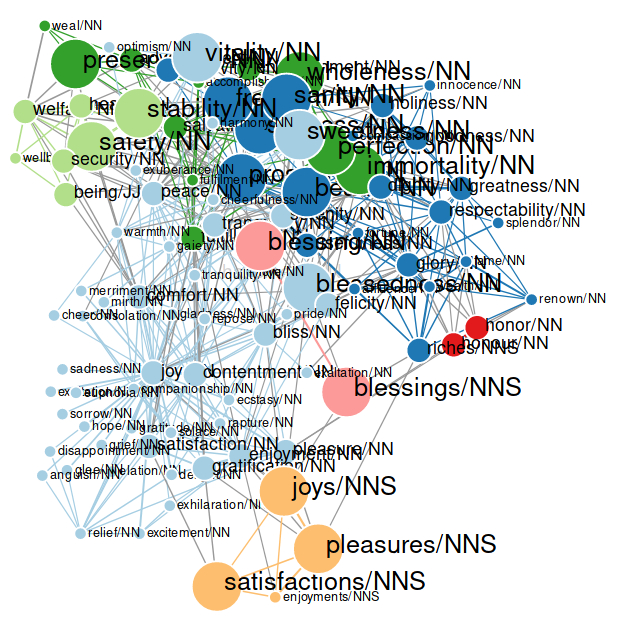
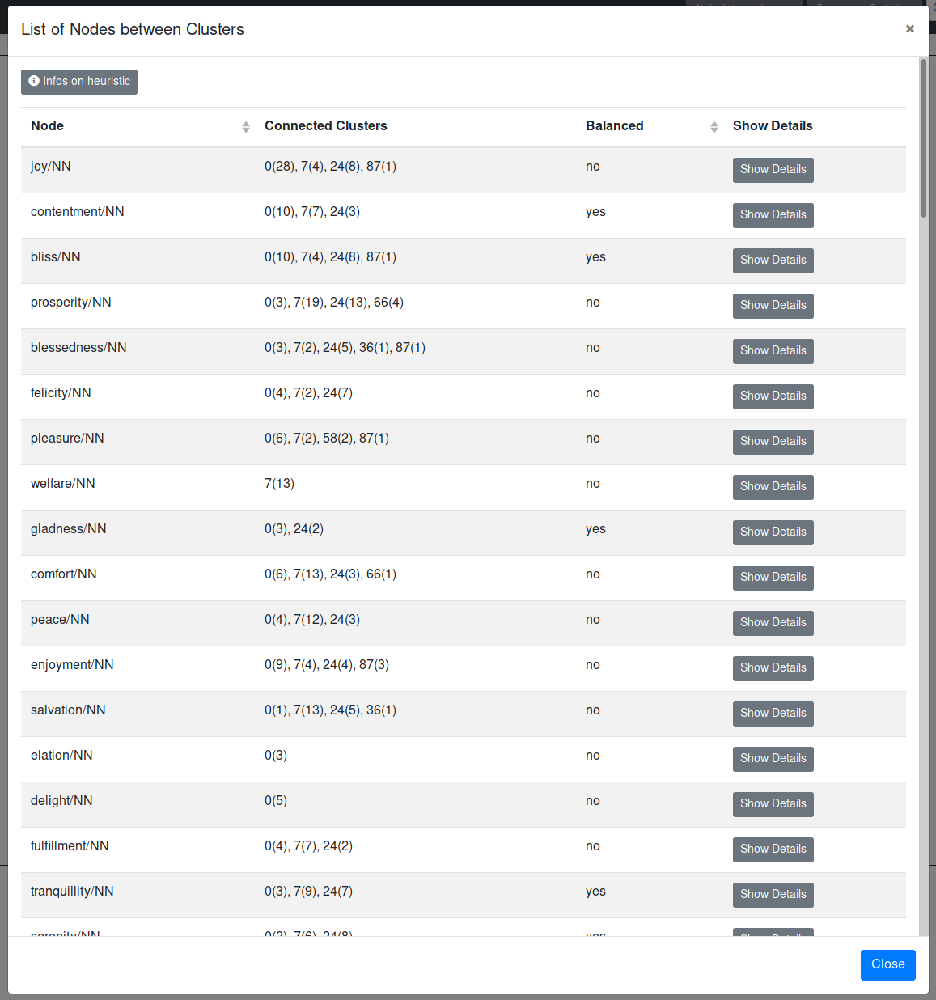

# The Functions of the Navbar

[Nodes between Clusters](##Nodes-between-Clusters)

[Betweenness Centrality](##Betweenness-Centrality)

[The Search Function](##The-Search-Function)

[Recluster Option](#Recluster-Option)

[Edit Graph Option](#Edit-Graph-Option)

[Reset Zoom Option](#Reset-Zoom-Option)

[Save the Current Graph](#Save-the-Current-Graph)

[Load a Previously Saved Graph](#Load-a-Previously-Saved-Graph)

## Nodes-between-Clusters

The above images shows dropdown menu options for highlighting nodes that are connected to more than one cluster with around the same amount of edges. Let's call them nodes with a balanced neighbourhood.

Clicking on the option "Highlight nodes in graph" results in the increased size of some nodes in the graph. There are three different sizes:

1. Small nodes - are only connected to nodes within the same cluster
2. Medium-sized nodes - are connected to more than one cluster, but do not have a balanced neighbourhood
3. Large nodes - are connected to more than one cluster and have a balanced neighbourhood

We use a heuristic to decide whether a node has a balanced neighbourhood or not.

We assume that the neighbourhood of a node is balanced, if there are at least two clusters for which
**max - d_i < mean/2** holds true.

Where

* *max* is the maximum number of nodes from the same cluster
* *d_i* is the number of nodes of cluster i
* *mean* is the mean number of nodes of a neighbouring cluster

The option "Reset highlighting" reverts all the nodes to their original size.

Selecting the third option "List nodes" gives the user information about the neighbourhood of each node. For each node the connected clusters are listed, as well as the number of nodes this specific node is connected to in each respective cluster. The list also tells the user, if the neighbourhood of the node was consideres balances or not. 

{:height="50%" width="50%"}

Clicking on the "Show Details" button lists all the nodes the node is connected to grouped by cluster.

## Betweenness-Centrality

## The Search Function

## Recluster Option

## Edit Graph Option

## Reset Zoom Option

## Save the Current Graph

## Load a Previously Saved Graph 