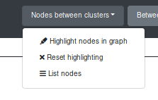
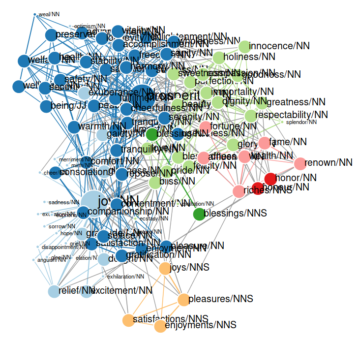
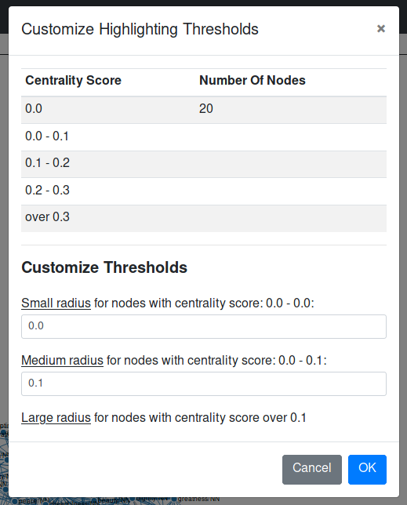
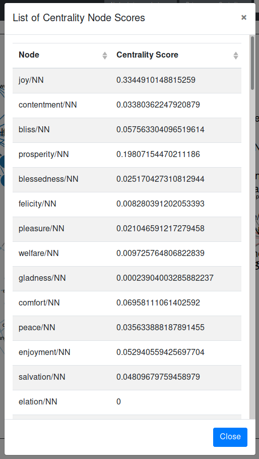
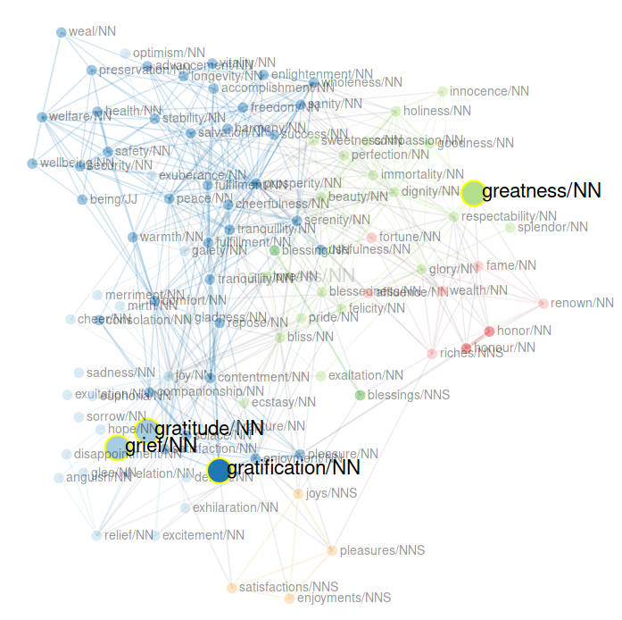
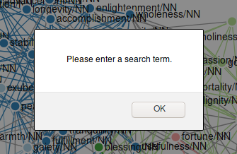
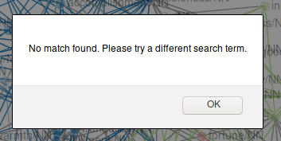

# The Functions of the Navbar

[Nodes between Clusters](#nodes-between-nlusters)

[Betweenness Centrality](#betweenness-centrality)

[The Search Function](#the-search-function)

[Recluster Option](#recluster-option)

[Edit Graph Option](#edit-graph-option)

[Reset Zoom Option](#reset-zoom-option)

[Save the Current Graph](#save-the-current-graph)

[Load a Previously Saved Graph](#load-a-previously-saved-graph)

## Nodes-between-Clusters

The above images shows dropdown menu options for highlighting nodes that are connected to more than one cluster with around the same amount of edges. Let's call them nodes with a balanced neighbourhood.

Clicking on the option "Highlight nodes in graph" results in the increased size of some nodes in the graph. There are three different sizes:

1. Small nodes - are only connected to nodes within the same cluster
2. Medium-sized nodes - are connected to more than one cluster, but do not have a balanced neighbourhood
3. Large nodes - are connected to more than one cluster and have a balanced neighbourhood

{:height="75%" width="75%"}

We use a heuristic to decide whether a node has a balanced neighbourhood or not.

We assume that the neighbourhood of a node is balanced, if there are at least two clusters for which
**max - d_i < mean/2** holds true.

Where

* *max* is the maximum number of nodes from the same cluster
* *d_i* is the number of nodes of cluster i
* *mean* is the mean number of nodes of a neighbouring cluster

The option "Reset highlighting" reverts all the nodes to their original size.

Selecting the third option "List nodes" gives the user information about the neighbourhood of each node. For each node the connected clusters are listed, as well as the number of nodes this specific node is connected to in each respective cluster. The list also tells the user, if the neighbourhood of the node was considered balanced or not. When the user clicks on the button "Infos on heuristic", they can see the heuristic we used to decide whether a node has a balanced neighbourhood.

{:height="75%" width="75%"}

Clicking on the "Show Details" button lists all the nodes the node is connected to grouped by cluster.

{:height="75%" width="75%"}

[To the top](#the-functions-of-the-navbar)

## Betweenness Centrality

Betweenness centrality is a common measure of centrality for graphs based on shortest paths. The betweenness centrality for each node is the number of shortest paths that pass through it. For more information see [Wikipedia](https://en.wikipedia.org/wiki/Betweenness_centrality) and the [Networkx documentation](https://networkx.github.io/documentation/latest/reference/algorithms/generated/networkx.algorithms.centrality.betweenness_centrality.html#networkx.algorithms.centrality.betweenness_centrality).

When clicking on the betweenness centrality button, a dropdown menu opens and the user can select different options.

The first option is to "Highlight central nodes in graph". Depending on their betweenness centrality score the nodes are displayed in different sizes.

{:height="75%" width="75%"}

A node can have one of three possible sizes depending on their centrality score. The defaults are:

1. Small nodes - nodes that have a centrality score of 0.0
2. Medium-sized - nodes that have a centrality score between 0.0 and 0.1
3. Large nodes - nodes that have a centrality score greater than 0.1

The second option "Customize highlighting thresholds" allows the user to determine which nodes should be small, medium-sized, or large based on their betweenness centrality score.

{:height="50%" width="50%"}

The option "Reset highlighting" reverts the size of the nodes back to their original sizes.

When the user selects the option "List centrality node scores" all the nodes are listed together with their respective betweenness centrality scores. The columns of the table are sortable.

{:height="50%" width="50%"}

[To the top](#the-functions-of-the-navbar)

## The Search Function

Since graphs with many nodes and links can get very complex, the user can search the graph for specific nodes. The search used prefix matching between the search term and the node labels. If one or more nodes that match the search term are found, they are highlighted in the graph.

The following image shows the highlighted search results of the search for "gr".

{:height="50%" width="50%"}

The user can reset the search highlighting by clicking on the "x" next to the search field.

If the user does not enter a search term, an alert is displayed, urging the user to do so.

{:height="75%" width="75%"}

If the search does not yield any results, an alert is also displayed.

{:height="75%" width="75%"}

[To the top](#the-functions-of-the-navbar)

## Recluster Option

The clusters in the graph are calculated using the Chinese Whispers algorithm. The algorithm is very fast, but non-deterministic. So you never know upfront how many clusters you will get and which nodes will belong to which cluster. Because of this, executing the algorithm several times may result in a different clustering each time. 

The user can execute the algorithm again by clicking on the button "Recluster".
This way, the user is able to see different hypothesis the system assumes about the senses of the target word. For more information on the Chinese Whispers Clustering Algorithm click [here](http://delivery.acm.org/10.1145/1660000/1654774/p73-biemann.pdf?ip=77.20.250.85&id=1654774&acc=OPEN&key=4D4702B0C3E38B35%2E4D4702B0C3E38B35%2E4D4702B0C3E38B35%2E6D218144511F3437&__acm__=1568553032_2c17e0dabf68573cf049cc4c8c1491be).

[To the top](#the-functions-of-the-navbar)

## Edit Graph Option

## Reset Zoom Option

## Save the Current Graph

## Load a Previously Saved Graph 