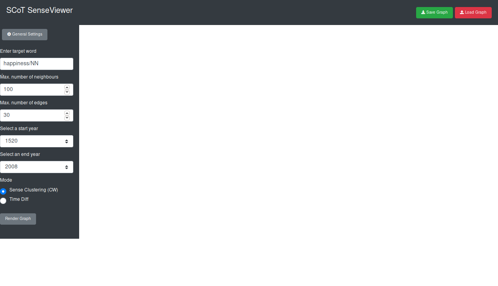

# Rendering a Graph
When the user first opens SCoT, they may either render a new graph by entering the required parameters in the left column or they can load a previously stored graph again from a file.




## Rendering a New Graph From the Database
If the user wants to render a new graph from the database, he or she needs to specify some parameters.


First, the user needs to enter a target word.

**Note:** Since currently I am working with a reduced database, there are only a limited number of target words available. 
These include:
"crisis/NN", "freedom/NN", "development/NN", "system/NN", "culture/NN", "work/NN", "labour/NN", "labor/NN", "security/NN", "safety/NN", "autonomy/NN", "order/NN", "experience/NN", "normality/NN", "medium/NN", "communication/NN", "value/NN", "worth/NN", "network/NN", "complexity/NN", "program/NN", "programme/NN", "diversity/NN", "change/NN", "life/NN", "sabotage/NN".

**Note:** For all words the respective part-of-speech tag needs to be appended to the query word. This is due to disambiguation purposes. The correct query word for "crisis" would therefore be "crisis/NN" or "crisis/NNP" (the latter is currently not contained in the database, since the target words are limited to the ones listed above). The data uses the [Penn Treebank POS tags](https://www.ling.upenn.edu/courses/Fall_2003/ling001/penn_treebank_pos.html).


Secondly, it needs to be specified how many nodes the graph should contain (a.k.a. "Number of neighbours"), as well as the maximum number of edges on a node. Per default the number of neighbours is set to 100 and the maximum number of edges is set to 30. Feel free to change them as you please.

Another parameter is the mode. However, a graph is always rendered in the sense clustering mode, so I recommend to just leave it as it is when rendering a new graph. The "Time Diff" mode is described in a separate [section](timeDiff.md).

Last but not least, the user has to specify the time period in which the collocations should occur. Per default this is set to encompass all the time slices (1520 - 2008).


## Rendering a Graph From a File
You can save a graph you have been working on to a JSON file by clicking on the "Save Graph" button in the top right-hand corner. Then the graph is downloaded as "graph.json". Where your graph is saved depends on your browser settings.

The json file has the following format (pseudo code):
```
{
  "links": [
    {
      "source": "joy/NN",
      "target": "delight/NN",
      "weight": "314"
    },
    ...
    ],
  "nodes": [
    {
      "id": "joy/NN",
      "x": 515.5573938806319,
      "y": 477.98070940597063,
      "class": "0",
      "cluster_name": "0",
      "cluster_node": "false",
      "colour": "#a6cee3",
      "time_ids": "7,5,6,4,8,3,2,1"
    },
    ...
    ],
  "singletons": [
    "unhappiness/NN",
    "misery/NN"
  ],
  "target": "happiness/NN",
  "link_distance": 100,
  "charge": -10,
  "start_year": 1520,
  "end_year": 2008,
  "time_diff": false
}
```

The graph in the json file can be loaded into SCoT again via the "Load Graph" button in the top right-hand corner. When clicking on the button a panel is opened where you can browse for your desired graph.json file in your file system.


Select your file, click "Render" and continue to work on your graph.
