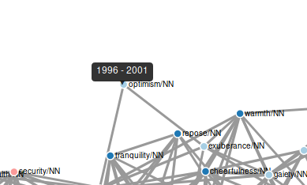
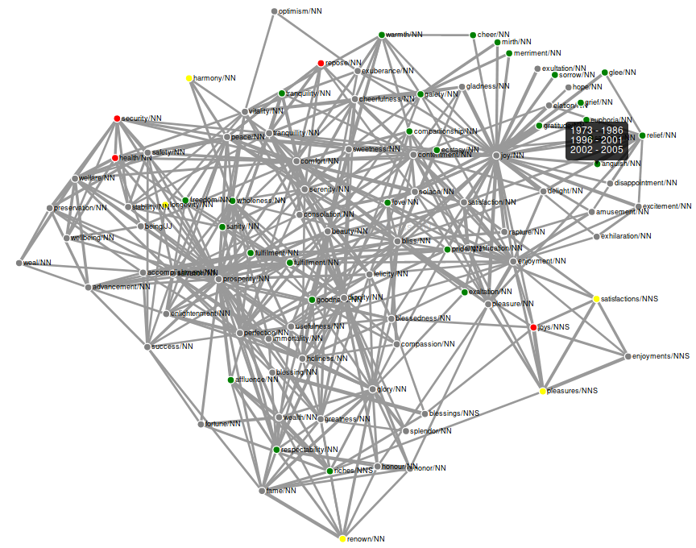
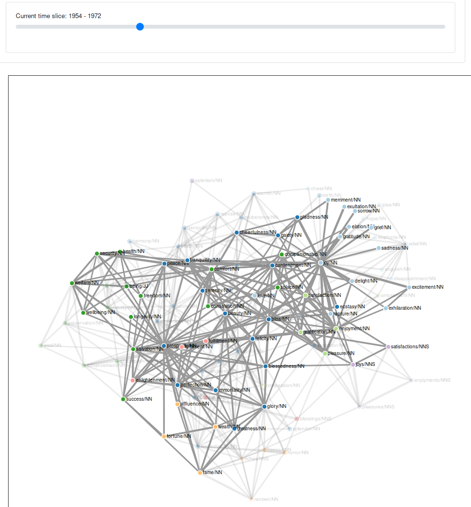

# Time Diff Mode
When selecting "time diff" mode in the parameter input column, two options are faded in: "Select interval" and "Skip through time slices".

When in this mode, several functionalities are disabled, such as updating the graph, reclustering, saving the graph, and editing the name and colour of clusters.

When hovering over nodes in time diff mode not only are only the neighbouring nodes faded in, but also a tooltip stating the time slices the node occurred in. In the example below, the particular node *optimism/NN* only appeared in the time slice from 1996 till 2001.

## Select Interval
With the option "Select Interval" the user can select a specific time interval within the original time period and compare the smaller interval to the bigger on.

In the example below, the interval from 1954 to 2001 is selected. Nodes that do not occur before 1520 and 1954 are categorized as *born* (green nodes), since they start to occur somewhere within the selected period. Nodes that do not occur between 2001 and 2008 are classified as *deceased* (red nodes), since they stop occurring within the the selected time period. Words that start and stop occurring within the selected time period are categorized as *shortlived* (yellow nodes). All other nodes occur consistently (grey nodes).

All the nodes of a category are listed when the user clicks on the "Nodes" button. When the user hovers over the coloured circle of a category with the cursor, the nodes belonging to this category are faded in in the graph.

In the graph, the nodes are coloured accordingly. The previous cluster colours are still visible in the edit graph column. 

To regain the cluster colours in the graph switch back to sense clustering mode.

## Skip through time slices
With the "Skip through time slices" option, you can look at each time slice of your originally selected time period of the graph individually. You can either use it directly when switching from the sense clustering mode or after changing the colour of the nodes via the "Select Interval" option. 

