# User Guide


## Introduction

SCoT can be found at: <http://ltdemos.informatik.uni-hamburg.de/scot/>

SCoT was developed in the context of the digital humanities. The aim is to provide a means to help linguists and those interested in diachronic semantics to visualize the different senses of a word over time. 


The main idea is that the user enters the word he or she is interested in and the different senses of this word are displayed in a clustered graph of its collocations for a certain time period. Collocations are words that appear in the same context as the queried word. The clusters are visualized through the colour of the nodes. An edge is drawn between two nodes if they are also collocations. The clusters are calculated using the Chinese Whispers algorithm and are only a first hypothesis. The clustering algorithm is non-deterministic, which means that the system may provide different hypotheses for the same graph if the algorithm is executed again.

**Note**: SCoT currently runs on a reduced database of Google Books ranging from 1520 to 2008. The data is split into eight time slices. This means that no exact years or time periods other than these time slices can be queried.


## Rendering a Graph
When the user first opens SCoT, he or she as two options to render a graph.


The user can either query the database or load an already existing graph from a json file.

### Rendering a Graph from the Database
If the user wants to render a new graph from the database, he or she needs to specify some parameters.

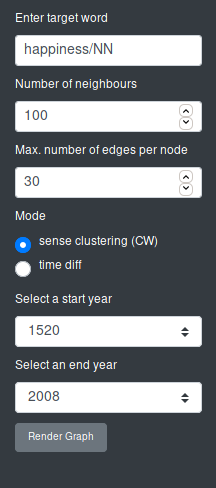

First, the user needs to enter a target word.

**Note:** Since currently I am working with a reduced database, there are only a limited number of target words available. 
These include:
"crisis", "freedom", "development", "system", "culture", "work", "labour", "labor", "security", "safety", "autonomy", "order", "experience", "normality", "medium", "communication", "value", "worth", "network", "complexity", "program", "programme", "diversity", "change", "life", "sabotage".

**Note:** For all words the respective part-of-speech tag needs to be appended to the query word. This is due to disambiguation purposes. The correct query words for "crisis" would therefore be "crisis/NN". The data uses the [Penn Treebank POS tags](https://www.ling.upenn.edu/courses/Fall_2003/ling001/penn_treebank_pos.html).


Secondly, it needs to be specified how many nodes the graph should have (aka. "Number of neighbours"), as well as the maximum number of edges on a node. Per default the number of neighbours is set to 100 and the maximum number of edges is set to 30. Feel free to change them as you please.

Another parameter is the mode. However, a graph is always rendered in the sense clustering mode, so I recommend to just leave it as it is when rendering a new graph. "time diff" is described in a later section.

Last but not least, the user has to specify the time period in which the collocations should occur. Per default this is set to the whole period of time.


### Rendering a Graph from a json file
You can save a graph you have been working on to a json file by clicking on the "Save Graph" button in the top right-hand corner. Then the graph is downloaded as "graph.json". Where your graph is saved depends on your browser settings.

The json file has the following format (pseudo code):
```
{
  "links": [
    {
      "source": "joy/NN",
      "target": "delight/NN",
      "weight": "314"
    },
    ...
    ],
  "nodes": [
    {
      "id": "joy/NN",
      "x": 515.5573938806319,
      "y": 477.98070940597063,
      "class": "0",
      "cluster_name": "0",
      "cluster_node": "false",
      "colour": "#a6cee3",
      "time_ids": "7,5,6,4,8,3,2,1"
    },
    ...
    ],
  "singletons": [
    "unhappiness/NN",
    "misery/NN"
  ],
  "target": "happiness/NN",
  "link_distance": 100,
  "charge": -10,
  "start_year": 1520,
  "end_year": 2008,
  "time_diff": false
}
```

The graph in the json file can be loaded into SCoT again via the "Load Graph" button in the top right-hand corner. When clicking on the button a panel is opened where you can browse for your desired json file in your file system.

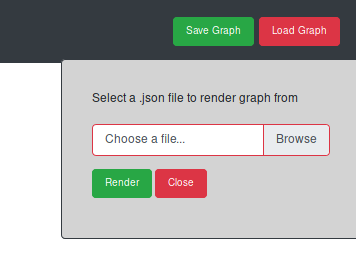

Select your file, click "Render" and continue to work on your graph.

## Interacting with the Graph
There are many ways to interact with the graph, examine and manipulate it.
Most of the manipulation functionalities are only available in the sense clustering mode.
The functionality buttons are only faded in, if a graph is rendered.


By clicking on the button "Recluster", the clustering algorithm is executed on the graph again, potentially resulting in a different hypothesis.

Clicking on the "Edit Graph" button opens up a column to the right of the graph with options to edit and examine the graph.

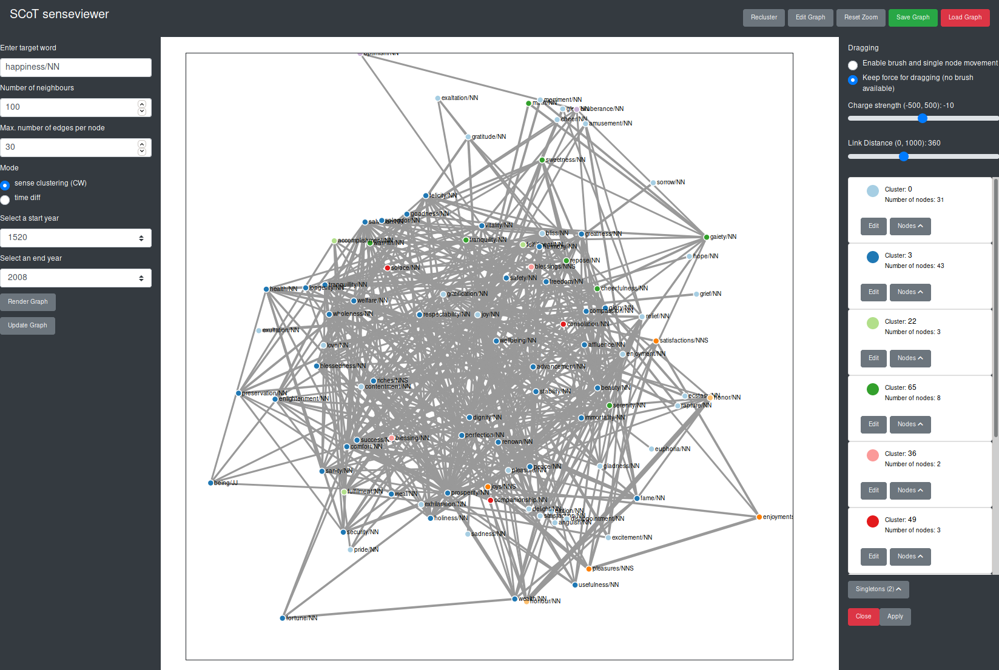

The functionalities available in the edit column are explained in detail in the sections below. The edit column can be closed via the "Close" Button at the bottom.

The button "Reset Zoom" resets all the zooming and panning activity to 0. You can zoom into the graph by scrolling in the box with the graph and pan by pressing and the moving the cursor within the box.


The graph is rendered using a force simulation, which means that the positions of nodes are automatically calculated according to different parameters such as the charge between them.

### Reclustering
When clicking the button "Recluster" in the top right-hand corner, the clustering algorithm is executed on the graph again. This may result in different clusters, since the algorithm used is non-deterministic. This way, the user is able to see different hypothesis the system makes about the senses of the target word. For more information on the Chinese Whispers Clustering Algorithm click [here](http://delivery.acm.org/10.1145/1660000/1654774/p73-biemann.pdf?ip=77.20.250.85&id=1654774&acc=OPEN&key=4D4702B0C3E38B35%2E4D4702B0C3E38B35%2E4D4702B0C3E38B35%2E6D218144511F3437&__acm__=1568553032_2c17e0dabf68573cf049cc4c8c1491be).

### Editing the Graph
The user can edit different aspects of the graph, e.g. manipulate simulation parameters, add nodes, name clusters amongst others.

#### Dragging Nodes
In the edit column the dragging behaviour of the nodes can be selected.


SCoT provides two different types of dragging behaviours for nodes. The default dragging behaviour is "Keep force for dragging (no brush available)".
Using this dragging behaviour, only one node at a time can be selected. The user selects a node by clicking on it. Then the selected node is marked with a red circle around it.


The selected node can then be moved to a different position through drag & drop. The nodes in the graph reposition themselves automatically according to the force simulation, as long as they have not been moved manually before. If a node as been dragged to a different position, it stays in that position, even if the simulation parameters are changed.

The other dragging behaviour is "Enable brush and single node movement". Using the dragging behaviour pauses the simulation, meaning you can select a node and drag it around without any other nodes following. You can also *brush* over several nodes to select them. To use the brush, hold down and drag the cursor, which opens up a box. All the nodes in this box are selected and can be dragged at the same time maintaining their exact positions to each other. To drag selected nodes, click on one of those nodes and drag it to its new position. The other nodes stay in the exact relative position to the dragged node.

#### Manipulate the Simulation
SCoT lets you edit two simulation parameters: the charge strength between the nodes and the link distance.
The default value for the charge strength is -10, the default value for the link distance is 100.
A graph with 100 nodes, 30 edges and these simulation parameter values looks like this:


Changing the charge strength influences the repelling forces between the nodes. The same graph with a charge strength of -252 and the default link distance looks as follows:


As a rule of thumb, a negative charge strength pushes the nodes further apart, simulating repulsion, and a positive charge strength pushes nodes together, simulating gravity or attraction.

The link distance influences the distance between nodes and therefore the length of the edges between them. A high link distance means a long distance between nodes, a low link distance means a small distance between nodes. The following example shows and graph with a link distance of 360 and the default charge.

 

#### Fade in Neighbours on Hover over Node
When hovering over a node in the graph only it and its neighbouring nodes as well as the edges between them are faded in. This way, the user can better explore the direct vicinity of a node.

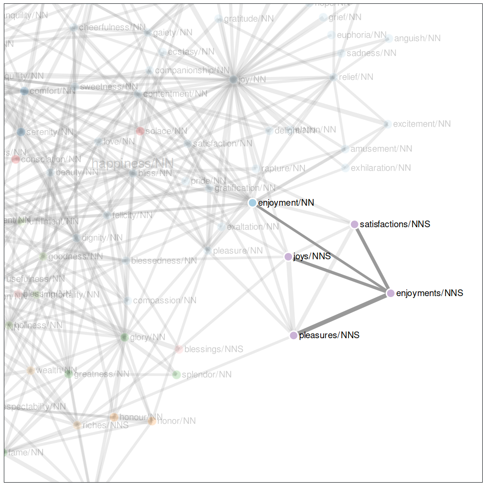

#### Add new Nodes to the Graph
The user can add new nodes to the graph via the "Update" button that is faded in beneath the "Render" button in the parameter input column as soon as a graph is rendered. Clicking on the button opens up a card, where the user can enter the number of nodes and the maximum number of edges per node in the updated graph. 


If the numbers are the same or less than the those in the graph that is to be updated no new nodes or edges are rendered. Otherwise the missing nodes and edges are added to the graph to match the input numbers when the user clicks on the button "Update".

The default number of updated nodes is 200, the default number of edges is 50.

**Note:** When updating the graph the previous clusters are lost, since the clustering algorithm is executed on the data again. Otherwise there would not be a cluster hypothesis for the newly added nodes.

If the nodes have been dragged beforehand they will stay in the position when adding new nodes to the graph. 


### Edit Clusters
The clusters produced by the program can be edited and if necessary corrected. In the edit column all the clusters in the graph are listed. For each cluster there are to buttons: one to edit the cluster and another to display a list of all the nodes in the respective cluster.


When hovering over the coloured circle next to the cluster name, all the nodes and edges in the graph belonging to the cluster are faded in in the graph.

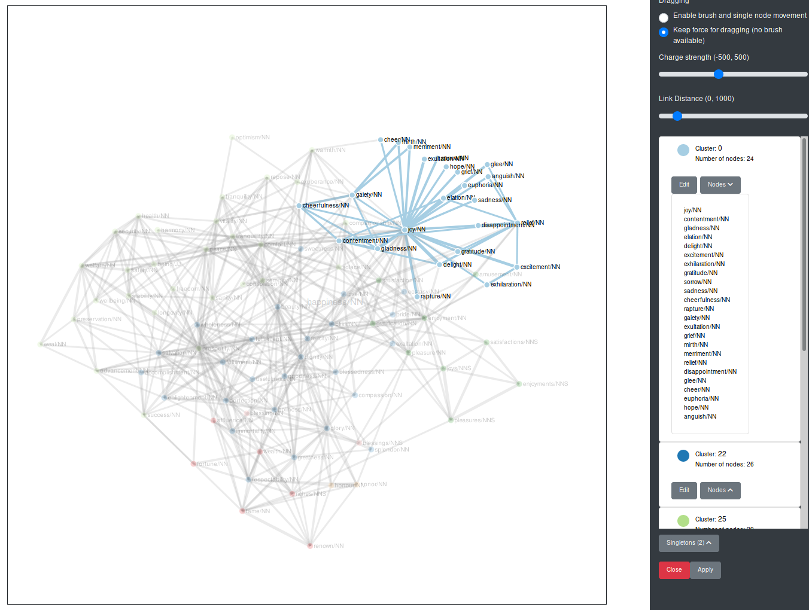


In some cases, nodes are not connected to any other in the graph. The are only neighbours to the target word. Then, the nodes are not rendered in the graph, but they are listed under "Singletons" in the edit column.

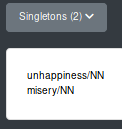


#### Edit Cluster Name
The program only numbers the clusters and it is up to the user to name the cluster. A cluster name can be changed via the edit button of a cluster.


The user can enter the new name in the text input field "Cluster Name". The name of the cluster is automatically updated while typing.

#### Edit Cluster Colour
The user can also select a different cluster colour by clicking on the colour field with the label "Select cluster colour" when editing a cluster. Then a colour picker opens and the user can select the new colour.

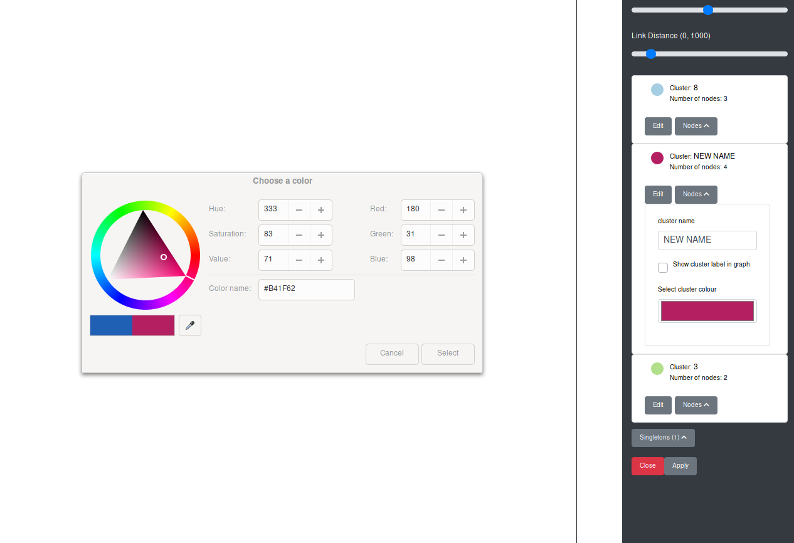

Your colour picker may look different to the one in the image, since the appearance of the colour picker depends on your browser.

The colour of the circle next to the cluster name is directly updated. However, to apply the new colour to the graph, the user needs to click on the button "Apply" at the bottom of the edit column.

The user can edit multiple clusters before clicking the "Apply" button to make the updated visible in the graph.

#### Add / Delete Cluster Node
The user can also add a special node with the cluster name to the graph for each cluster - sort of like a label to a cluster. This node has edges to all the other nodes in the cluster.


To add a new cluster label, the user ticks the box "Show cluster label in graph" when editing a cluster and clicks the "Apply" button at the bottom of the edit column.

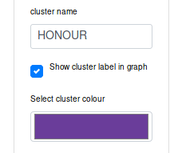

For each cluster only one cluster node can be added.

When reclustering the graph, the old labels are kept in the graph. Since the reclustering produced new clusters on the graph, the user can add new cluster labels. The old labels are kept, so that the clusters can be more easily compared. When hovering over a cluster node, all the nodes connected to it (i.e. all the nodes in the cluster) are faded in.

The same behaviour is displayed when updating the graph.

Cluster labels can be deleted via selecting them (clicking on them) and then pressing `BACKSPACE`.

**Note of caution:** Currently, selected cluster nodes are always deleted when pressing `BACKSPACE`. This is not ideal, I know, and I am going to solve this. However, until I do, please make sure you have selected a non-cluster node when editing e.g. a cluster name. Otherwise, you might accidentally delete a cluster node.

#### Assign a Node to a Different Cluster
In case the user does not agree with the system hypothesis, he or she can assign a node to a different existing cluster.
When clicking on a node, an "Options" button appears in the corner above the graph.

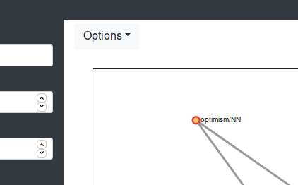

A click on this buttons opens a dropdown menu. Currently, the only option available is "Assign to different cluster". After selecting this option, a modal is opened, in which the selected node, its current cluster and an input field in which the user can enter the new cluster of the node.


On clicking "OK", the node's colour changes to the one of the newly assigned cluster. It also changes the cluster in the cluster list.

If a cluster labels are used, they do not automatically update, but have to be deleted manually and reentered with the updated clusters via the edit function of the respective cluster.


## Time Diff Mode
When selecting "time diff" mode in the parameter input column, two options are faded in: "Select interval" and "Skip through time slices".


When in this mode, several functionalities are disabled, such as updating the graph, reclustering, saving the graph, and editing the name and colour of clusters.

When hovering over nodes in time diff mode not only are only the neighbouring nodes faded in, but also a tooltip stating the time slices the node occurred in. In the example below, the particular node *optimism/NN* only appeared in the time slice from 1996 till 2001.


### Select Interval
With the option "Select Interval" the user can select a specific time interval within the original time period and compare the smaller interval to the bigger on.

In the example below, the interval from 1954 to 2001 is selected. Nodes that do not occur before 1520 and 1954 are categorized as *born* (green nodes), since they start to occur somewhere within the selected period. Nodes that do not occur between 2001 and 2008 are classified as *deceased* (red nodes), since they stop occurring within the the selected time period. Words that start and stop occurring within the selected time period are categorized as *shortlived* (yellow nodes). All other nodes occur consistently (grey nodes).

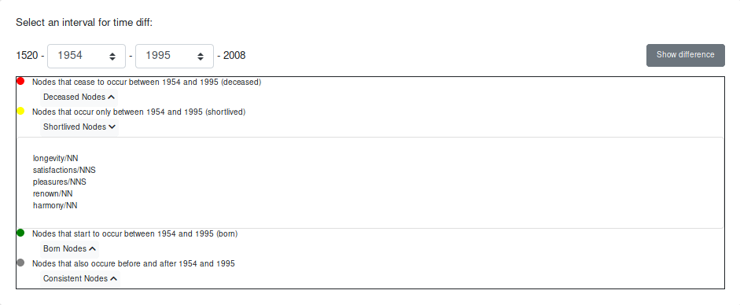

All the nodes of a category are listed when the user clicks on the "Nodes" button.

In the graph, the nodes are coloured accordingly. The previous cluster colours are still visible in the edit graph column. 

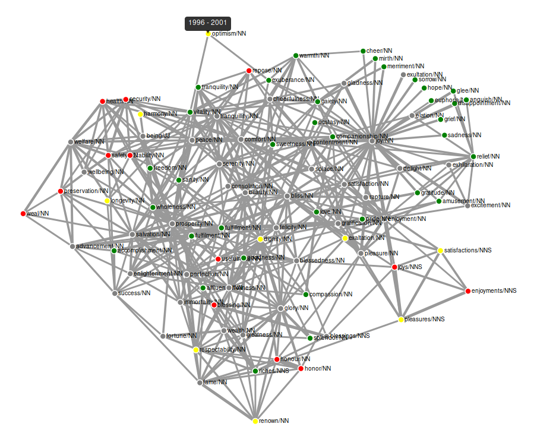

**Note of caution:** At the moment, some edge cases are not categorized correctly - I only just noticed that there ARE in fact cases I did not consider - e.g. nodes that are born after the selected time period are still classified as born, since there is no other category they would fit.

To regain the cluster colours in the graph switch back to sense clustering mode.

### Skip through time slices
With the "Skip through time slices" option, you can look at each time slice of your originally selected time period of the graph individually. You can either use it directly when switching from the sense clustering mode or after changing the colour of the nodes via the "Select Interval" option. 

